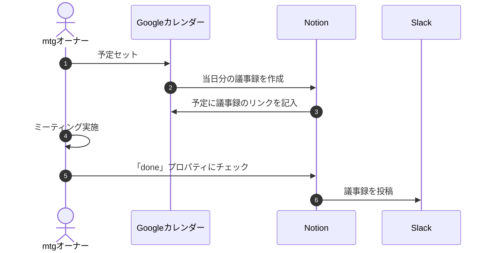

# 議事録作成~Slack投稿の自動化をしたい

[株式会社TERASS](https://terass.com/)で主にフロントエンドエンジニアをしている越前です。

弊社には、**ミーティングの際はNotionで議事録を取り、ミーティング後に話したことや決まったことをSlackに投稿する**、という文化があります。

情報の透明性を担保し、生産性の高いミーティングを行うことを目的に行われているこの取り組みですが、手動で行おうとするとどうしても面倒な作業が発生してしまいます。

そこでエンジニアチームがGoogle Calendar API, Notion API, Slack APIを使ってこの流れの一部を自動化したので今回はその取組をご紹介します。

## 自動化の全体像

議事録作成~Slack投稿の具体的な流れは以下です。

1. Google Calendarにミーティングの予定を作る
2. Notionの議事録用データベース(以下`meeting-notes`)にそのミーティング用のページを追加
3. ミーティングの主催者はアジェンダを予め書き込む
4. ミーティングを行い、議事録を取る
5. 主催者はSlackに議事録の一部（Summary）を投稿する


*Slackに投稿される議事録のイメージ。*

以上の流れの中で、 `2.` と `5.` をGoogle Calendar, Notion, SlackのAPIを使っての自動化を行いました。

以下が自動化の流れのイメージです。



できるだけシンプルに構築したかったため、定期実行されるGoogle Cloud Functionのみで完結するように実装しました。言語はTypeScriptです。

図中の `2. 当日分の議事録を作成` と `6. 議事録を投稿`をそれぞれ`calendarToNotion`と`notionToSlack`という定期実行されるfunctionとして実装します。

## 1. 議事録を作成する （`calendarToNotion`）

Google Calendar APIから予定を取得し、Notionのデータベースにその議事録用のページを作るfunctionです。

ここでの検討事項は2つです。

1. カレンダーの予定全てについて議事録が作られると困る（ミーティング以外の予定など）
2. functionのトリガーのタイミング

`1.` については、議事録用のサービスアカウントを作成し、そのアカウントがゲストとなっている予定のみ議事録を作成するようにします。

`2.` のfunctionのトリガーについては、Google Calendar APIでは予定の作成、変更の通知を[Webhookで受け取る](https://developers.google.com/calendar/api/guides/push?hl=ja)ことが出来るため、当初はそれをトリガーにしてNotion APIを叩き…という形を考えていたのですが、その場合**ミーティングの大部分を占める定期的な予定が扱いづらい**、という問題がありました。

また、議事録の雛形を自動ではなく手動で用意したいというユースケースも考えられたので、最終的に 「**毎日午前二時に`calendarToNotion`を定期実行し、その日のミーティングの議事録がまだNotionのデータベース（以下`meeting-notes`）に作られていない場合、議事録を作成する**」という形に落ち着きました。

これにより、定期的な予定的な予定の扱いと手動での議事録作成の双方に対応することができました。

最後に、ミーティングの参加者が議事録に簡単にアクセス出来るようにするために、`meeting-notes`に議事録ページを作成した後はそのページのURLをcalendarの予定のdescriptionに追加するようにします。

以下がそのfunctionの実装の一部です（簡単のため一部改変）。
```ts
/** Google Calendarから予定を取得し、Notionに議事録用ページを作成する */
export const calendarToNotion = async (start: string, end: string) => {
  // カレンダーから指定した期間の予定を取得
  const events = await fetchEvents(start, end)
  const notionClient = new Client({ auth: process.env['NOTION_SECRET'] })

  for (const event of events) {
    // 既に議事録が作成してある場合などはスキップする
    if (!(await needToCreateMeetingNote(notionClient, event))) {
      continue
    }
    const startDate = event.start.tz('Asia/Tokyo').format('YYYYMMDD')

    // ミーティング参加者とオーナーの、Notion上のidを取得
    // 議事録データベースの「参加者」などのプロパティを埋めるため
    const attendeeNotionIds = fetchAttendeeNotionIds(notionClient, event.atendees)
    const organizerNotionId = fetchOrganizerNotionId(event.organizer)

    const title = `${startDate}_${event.summary}`

    // Notionのデータベースにページを作成
    const entry = createMeetingNoteEntry(
      allMeetingsDatabaseId,
      title,
      event.start.tz('Asia/Tokyo').format('YYYY-MM-DD'),
      organizerNotionId,
      attendeeNotionIds,
    )
    const createPageResponse = await createNotionPage(notionClient, entry)
    
    // calendarの予定のdescriptionに議事録のURLを追加する
    await updateDescription(event.organizer, event.id, `${createPageResponse.url}\n${event.description}`)
  }
}
```

## 2. ミーティングを行い議事録を取る

ここは普通に人が行う部分です。

議事録にはSummaryというh1見出しが自動で作成されており、ここ以下が後ほどSlackに投稿されます。


*自動で作られる議事録の雛形*

ミーティングが終わり、議事録が完成したら`Done`プロパティにチェックを入れます。これが後ほどSlackに投稿されるための条件になります。


*doneにチェックを入れる*


## 3. 議事録がSlackへ投稿される （`notionToSlack`）

こちらは10分ごとに定期実行されるfunctionで、`meeting-notes`から対象の議事録（直近でdoneにチェックが入り、かつまだSlackへの投稿が済んでいないもの）を取ってきて、Slackへ投稿します。

Notion APIからはページの内容が[このような](https://developers.notion.com/reference/page)構造データで渡って来るので、それをSlackに投稿するための文字列（Markdownっぽいが、Slack独自の記法）に変換してやる必要があります。

見出しや箇条書きなどは愚直に変換すれば良い話ですが、一つ困ったのが**議事録中のメンションの処理**です。

というのも、Notionのページ中のメンションはNotion上のユーザーIDとしてAPIから渡って来ますが、それをSlack上でのメンションにするためにはSlack側のユーザーIDが必要となります。

つまり、人ごとのNotionユーザーIDとSlackユーザーIDの紐づけをどこかに持っておく必要があります。

このプロジェクト内でデータはなるべく持ちたくなかったため。弊社Notionにある社員一覧のデータベースを利用することにしました。ここにSlackとNotionそれぞれのユーザーIDを持たせておき、function実行時にここに問い合わせます。

以下が実際のfunctionのコードの一部です（簡単のため一部改変）。
```ts
export const notionToSlack = async (date: string) => {
  const databaseId = config.notion.ALL_MEETINGS_DATABASE_ID
  const notionClient = new Client({ auth: process.env['NOTION_SECRET'] })

  // 直近でDoneにチェックが入れられた議事録をNotionから取得
  const notes = await fetchRecentNotes(notionClient, databaseId, date)

  for (const note of notes) {
    // 議事録のタイトルとSummary以下を取得
    const { title, summary } = await fetchMeetingNoteSummary(notionClient, note.id)

    // NotionのページのデータをSlackに投稿するメッセージに変換
    const message = await summaryToSlackMessage(summary)

    // オーナー、参加者のSlack上のユーザーIDを取得
    const { ownerSlackId, membersSlackIds } = fetchSlackIds(note)

    // Slackに投稿する際一番上に表示されるテキスト
    const topText = membersSlackIds.reduce(
      (acc, memberSlackId) => `${acc}<@${memberSlackId}>`,
      `<${note.url}|${title}>\n*Owner*: <@${message.owner}>\n*Member*: `,
    )

    // Slackに投稿
    await sendMeetingNotesSummary(`${topText}\n${summary}`)
  }
}
```

以下のような議事録のSummaryが、


以下のようにSlackへ自動で投稿されます。

*Notion中のメンションがSlack上でもメンションになる*

## 終わりに

議事録作成と投稿の自動化の取組を紹介しました。

議事録は手動で作ろうとすると面倒なことも多いので、その作業の一部を自動化出来るのは大きな意味があると思います。

以上、何かの参考になれば幸いです。